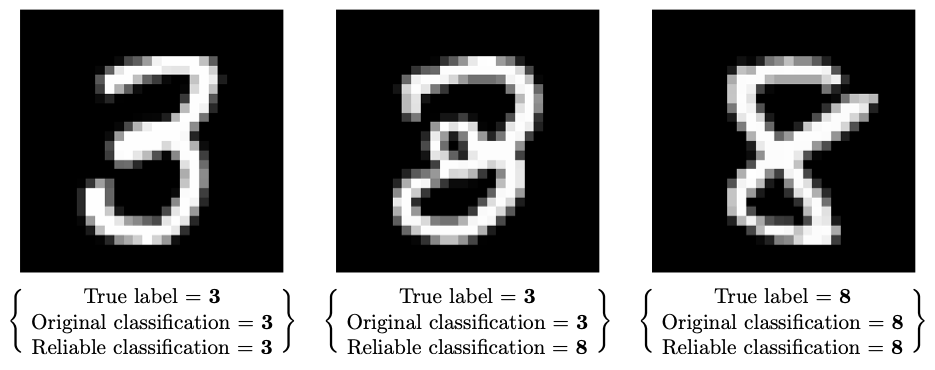
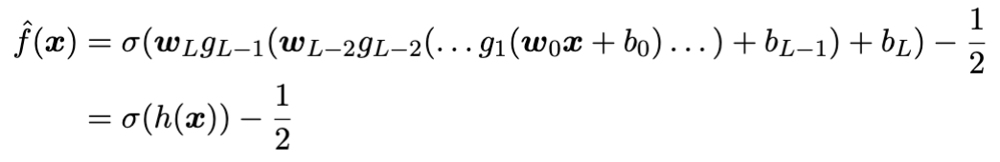
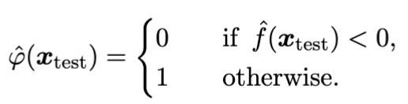
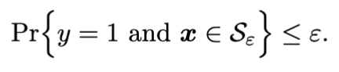

# Deep-Probabilistic-Scaling

Deep Probabilistic Scaling (DPS) is an uncertainty quantification tool for the control of misclassification error in (binary) neural classification. The algorithm relies on probabilistic scaling, a branch of [order statistics](https://en.wikipedia.org/wiki/Order_statistic) for non-parametric inference with confidence bounds on the prediction. 

DPS is a direct application of [Scalable Classification](https://paperswithcode.com/paper/probabilistic-safety-regions-via-finite) to convolutional neural networks for (binary) classification:

    

that is the predictor function of the network $\hat \varphi$ such that

    

This framework allows to define a special region $\mathcal{S}_\varepsilon$ such that the probability of observing a false negative is bounded by $\varepsilon$:

    

## Content of the Repository

This repository contains experiments to validate DPS algorithm. Specifically in the notebook "DeepSC_ProbScaling.ipynb" you can find the main code to implement DPS on several benchmark data (contained in the "data" folder) and with different convolutional models (contained in the "model" folder).

## References

DPS was implemented for a research paper presented to [COPA2024](https://www.copa-conference.com/) on the basis of the concept paper 

Carlevaro, Alberto, et al. "Probabilistic Safety Regions Via Finite Families of Scalable Classifiers." arXiv preprint arXiv:2309.04627 (2023).
